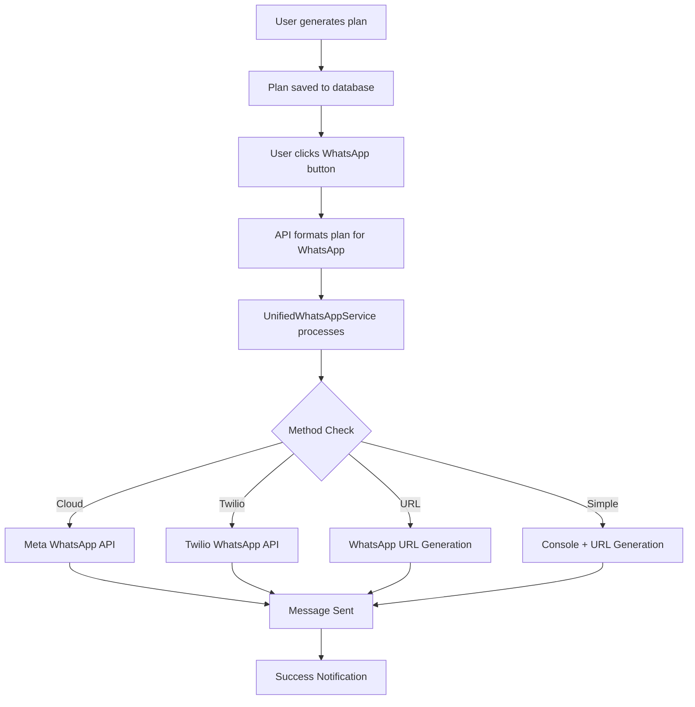

# 📱 WhatsApp Training Plan Notifications - Implementation Guide

## 🎯 Overview

The Coach AI system now includes comprehensive WhatsApp integration to automatically send personalized training plans to users via WhatsApp. This feature allows athletes to receive their AI-generated training plans directly on their phones for easy access and reference.

## ✅ What's Implemented

### 1. Enhanced Coach Notifications API (`/api/coach/notifications/route.ts`)
- **New notification type**: `training_plan` for sending complete training plans
- **Session integration**: Automatically uses user's mobile number from session
- **Structured plan formatting**: Converts training plans into WhatsApp-friendly format
- **Multiple notification types**: Daily motivation, reminders, and training plans

### 2. Training Plan Formatting
- **Smart text formatting**: Converts complex training plan objects into readable WhatsApp messages
- **Emoji integration**: Uses sports and fitness emojis for better visual appeal
- **Length optimization**: Ensures messages fit within WhatsApp character limits
- **Structured layout**: Organized sections for overview, schedule, nutrition, and tracking

### 3. Coach Page Integration
- **WhatsApp button**: Added in the action buttons section when plan is generated
- **Real-time notifications**: Shows success/error feedback with styled notifications
- **Loading states**: Proper loading indicators during WhatsApp sending
- **Session tracking**: Maintains user session for automatic phone number detection

### 4. Multiple WhatsApp Methods Support
- **Unified service**: Uses `UnifiedWhatsAppService` with multiple fallback options
- **Method selection**: Configurable via `WHATSAPP_METHOD` environment variable
- **Fallback options**: Cloud API → Twilio → URL Generation → Simple Console

## 🚀 Key Features

### Training Plan Notification
```typescript
// Automatic WhatsApp notification when plan is generated
const sendWhatsAppNotification = async () => {
  const response = await fetch('/api/coach/notifications', {
    method: 'POST',
    headers: { 'Content-Type': 'application/json' },
    body: JSON.stringify({
      type: 'training_plan',
      plan: generatedPlan,
      userInfo: { name: formData.name, sport: formData.sport }
    })
  });
};
```

### Formatted WhatsApp Message Example
```
🤖 The Coach - AI Training Plan

Hi John! 👋

🎯 Your Personalized Badminton Training Plan
📅 Generated on Monday, October 2, 2025

📋 Plan Overview:
Comprehensive training program targeting technique improvement and endurance building...

📅 Weekly Schedule:
• Monday: Foundation & Strength Building
• Tuesday: Skill Development & Technique
• Wednesday: Cardio & Endurance Training
• Thursday: Power & Agility Work
• Friday: Sport-Specific Practice
• Saturday: Active Recovery & Mobility
• Sunday: Rest & Mental Preparation

🥗 Nutrition Tips:
• Stay hydrated with 3-4 liters of water daily
• Eat protein within 30 minutes post-workout
• Include complex carbs for sustained energy

💪 Ready to transform your game?

📱 Keep this plan handy and follow it consistently for best results!

🌟 Remember: Consistency is key to achieving your goals!

Powered by The Coach AI 🚀
```

## 🛠️ Configuration

### Environment Variables
```bash
# WhatsApp Method Selection
WHATSAPP_METHOD=simple  # Options: cloud, twilio, url, simple

# Simple Method (Console + URLs) - Always works
NEXT_PUBLIC_WHATSAPP_PAYMENT_NUMBER=919787020525

# Twilio Configuration (if using Twilio method)
TWILIO_ACCOUNT_SID=your_account_sid
TWILIO_AUTH_TOKEN=your_auth_token
TWILIO_WHATSAPP_FROM=whatsapp:+14155238886

# Meta WhatsApp Cloud API (if using Cloud method)
WHATSAPP_ACCESS_TOKEN=your_access_token
WHATSAPP_PHONE_NUMBER_ID=your_phone_number_id
```

## 📱 How It Works

### 1. User Journey
1. User completes the 5-step Coach assessment
2. AI generates personalized training plan
3. Plan is automatically saved to MongoDB database
4. User clicks "📱 Send to WhatsApp" button
5. Plan is formatted and sent via chosen WhatsApp method
6. Success notification appears on screen

### 2. Technical Flow


### 3. Plan Formatting Algorithm
```typescript
function formatTrainingPlanForWhatsApp(plan: any, userInfo: any): string {
  // 1. Extract key information from plan object/string
  // 2. Structure into readable sections
  // 3. Add emojis and formatting
  // 4. Ensure WhatsApp character limit compliance
  // 5. Return formatted message
}
```

## 🧪 Testing

### Test Endpoint
- **URL**: `/api/test-coach-whatsapp`
- **Method**: POST
- **Body**: `{ "phoneNumber": "919787020525" }`
- **Test Page**: `http://localhost:3000/test-coach-whatsapp.html`

### Testing Methods
1. **Automated Testing**: Use the test endpoint with sample data
2. **Manual Testing**: Generate a real plan in Coach system and send via WhatsApp
3. **Multiple Methods**: Test different WhatsApp methods (simple, Twilio, Cloud API)

## 📊 Integration Points

### 1. MongoDB Collections
- **coach_users**: User profiles and assessments
- **generated_plans**: AI-generated training plans
- **coach_sessions**: User session tracking

### 2. API Endpoints
- **POST /api/coach/notifications**: Send WhatsApp notifications
- **POST /api/coach/save**: Save plan and user data
- **POST /api/test-coach-whatsapp**: Test WhatsApp functionality

### 3. Frontend Components
- **Coach Page**: Main training plan generation interface
- **WhatsApp Button**: Integrated in action buttons section
- **Notification System**: Success/error feedback display

## 🎨 UI/UX Features

### WhatsApp Button Styling
- **Color**: WhatsApp green gradient (#25d366, #128c7e)
- **Icon**: 📱 Phone emoji for instant recognition
- **Feedback**: Loading states and success notifications
- **Position**: Prominently placed in action buttons section

### Success Notification
- **Design**: Floating notification with WhatsApp colors
- **Duration**: 4-second auto-dismiss
- **Content**: Confirmation message with delivery status
- **Animation**: Smooth fade-in/fade-out effects

## 📈 Benefits

### For Athletes
- **Instant Access**: Training plans delivered directly to phone
- **Offline Availability**: Plans accessible without internet via WhatsApp
- **Easy Reference**: Can refer to plan anywhere, anytime
- **Shareable**: Can share with coaches or training partners

### For Coaches/Admins
- **Automated Delivery**: No manual sending required
- **Professional Presentation**: Well-formatted, branded messages
- **Delivery Confirmation**: Know when plans are sent successfully
- **Multiple Methods**: Fallback options ensure delivery

### For System
- **Scalable**: Handle multiple notification methods
- **Reliable**: Multiple fallback options prevent failures
- **Trackable**: All notifications logged and tracked
- **Cost-Effective**: Simple method works without external services

## 🔧 Troubleshooting

### Common Issues
1. **Phone Number Format**: Ensure country code is included (e.g., 919787020525)
2. **Session Issues**: User must be logged in with mobile number
3. **WhatsApp Method**: Check WHATSAPP_METHOD environment variable
4. **Network Issues**: Verify external API credentials for Twilio/Cloud methods

### Debug Steps
1. Check server console for WhatsApp service logs
2. Verify environment variables are set correctly
3. Test with simple method first (always works)
4. Use test endpoint to isolate issues

## 🚀 Future Enhancements

### Planned Features
1. **Scheduled Notifications**: Daily/weekly training reminders
2. **Progress Updates**: Track and send progress via WhatsApp
3. **Interactive Messages**: Buttons for plan feedback
4. **Rich Media**: Images and documents for exercise demonstrations
5. **Group Notifications**: Send to coaches and athletes simultaneously

### Integration Opportunities
1. **Calendar Integration**: Send training schedule to calendar apps
2. **Wearable Sync**: Connect with fitness trackers for progress updates
3. **Video Tutorials**: Include exercise video links in messages
4. **Nutrition Tracking**: Detailed meal plans via WhatsApp

## 📝 Code Examples

### Send Custom Training Plan
```typescript
// In Coach page component
const sendCustomPlan = async () => {
  const response = await fetch('/api/coach/notifications', {
    method: 'POST',
    headers: { 'Content-Type': 'application/json' },
    body: JSON.stringify({
      type: 'training_plan',
      plan: customPlan,
      userInfo: { name: 'John Doe', sport: 'Tennis' },
      phoneNumber: '919787020525' // Optional override
    })
  });
};
```

### Format Custom Message
```typescript
// Custom message formatting
const customMessage = `🎾 Tennis Training Alert!

Hi ${athleteName}! 

Today's Focus: Backhand Technique
Duration: 90 minutes
Intensity: High

Ready to improve your game? 💪

Powered by The Coach AI 🤖`;

await unifiedWhatsAppService.sendCustomMessage(phoneNumber, customMessage);
```

## 🎯 Success Metrics

### Delivery Tracking
- **Success Rate**: Percentage of successful WhatsApp deliveries
- **Method Performance**: Which WhatsApp method works best
- **User Engagement**: How often users request WhatsApp delivery
- **Error Patterns**: Common failure points and resolutions

### User Satisfaction
- **Convenience Rating**: User feedback on WhatsApp delivery
- **Plan Accessibility**: How often users reference WhatsApp plans
- **Feature Adoption**: Percentage of users using WhatsApp feature
- **Retention Impact**: Effect on user engagement and retention

---

## 🏆 Summary

The WhatsApp Training Plan Notification system provides a seamless way for athletes to receive their AI-generated training plans directly on their phones. With multiple delivery methods, professional formatting, and comprehensive error handling, this feature enhances the overall user experience and makes training plans more accessible and actionable.

The system is production-ready with proper error handling, user feedback, and multiple fallback options to ensure reliable delivery across different environments and configurations.